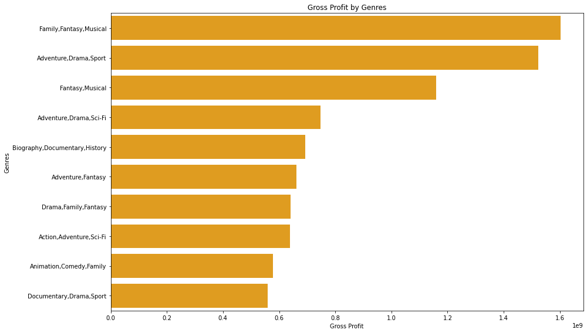

Game On: Leveraging Box Office Trends for Microsoft's Movie Studio

photo by Bruce.Nash on [thenumber](https://www.the-numbers.com/images/movies/If-(2024)-2-News.jpg)

Overview
My aim is to  dive into the current  microsoft box office landscape, uncovering trends that can empower Microsoft's  movie studio to make strategic decisions about its film . By analyzing popular genres,top grossing films, audience demographics, and distribution strategies that will provide actionable insights to guide the studio towards box office success.

Task
Microsoft wants to get in on the excitement after noticing that all the major corporations are producing original video content. They don't know anything about making movies, yet they have decided to start a new studio. It is your responsibility to research the kinds of movies that are currently doing the best at the box office. The next step is to convert those results into practical advice that the president of Microsoft's new film company may use to choose the kind of movies that should be made.

## Business Understanding
Microsoft lacks experience in the film industry and wants to establish a movie studio.
In order to determine which movies the corporation should invest in most strategically, I have been entrusted with looking over box office data.

# Objectives

To help me reach my goal, I made the decision to divide the primary target into smaller, more focused goals, like these:

1.To determine the demographic we want to target in order to create material that will appeal to them and help Microsoft achieve box office success.

2.To ascertain the method of distribution to be employed for seeing the films—in theaters or on streaming services—so that the business can capitalize on it.

3.Using the data analysis, to determine which movie genres are the most strategically important to generate.

4.To identify the highest grossing movies in which the business can make investments by examining the production costs in order to optimize profits.

## Data Understanding

Three different files will serve as the data sources for this research.

1.im.db

*Source*-This data set comes from [IMDB](https://www.imdb.com/) a public and free movie database

*Content*-This set of data contains pertinent statistics, like movie ratings and movie fundamentals, that we will use to analyze our issue.

*Format*-The format for this data set is SQL

2.tmdb.movies.csv 

*Source*This data set comes from [TMDB](https://www.themoviedb.org/).It is a community-built library of films and television shows with an emphasis on global communities and a vast amount of data.

*Content*We will use vote count, popularity, and genre IDs in this set of important variables for our study
*Format*-This data is in csv file format

3.tn.movies_budgets.csv

*Source*This data set comes from [TheNumbers](https://www.the-numbers.com/) This is a website that offers past box office information for motion pictures.

*Content*he set's data is arranged according to a number of criteria, such as budget, genre, release date, and domestic/international gross. These numbers immediately answer our inquiries concerning the highest-grossing movies.
*Format*-The format of this data set is a CSV file

## Data Understanding

Three different files will serve as the data sources for this research.

1.im.db

*Source*-This data set comes from [IMDB](https://www.imdb.com/) a public and free movie database

*Content*-This set of data contains pertinent statistics, like movie ratings and movie fundamentals, that we will use to analyze our issue.

*Format*-The format for this data set is SQL

2.tmdb.movies.csv 

*Source*This data set comes from [TMDB](https://www.themoviedb.org/).It is a community-built library of films and television shows with an emphasis on global communities and a vast amount of data.

*Content*We will use vote count, popularity, and genre IDs in this set of important variables for our study
*Format*-This data is in csv file format

3.tn.movies_budgets.csv

*Source*This data set comes from [TheNumbers](https://www.the-numbers.com/) This is a website that offers past box office information for motion pictures.

*Content*he set's data is arranged according to a number of criteria, such as budget, genre, release date, and domestic/international gross. These numbers immediately answer our inquiries concerning the highest-grossing movies.
*Format*-The format of this data set is a CSV file

## Data Understanding

Three different files will serve as the data sources for this research.

1.im.db

*Source*-This data set comes from [IMDB](https://www.imdb.com/) a public and free movie database

*Content*-This set of data contains pertinent statistics, like movie ratings and movie fundamentals, that we will use to analyze our issue.

*Format*-The format for this data set is SQL

2.tmdb.movies.csv 

*Source*This data set comes from [TMDB](https://www.themoviedb.org/).It is a community-built library of films and television shows with an emphasis on global communities and a vast amount of data.

*Content*We will use vote count, popularity, and genre IDs in this set of important variables for our study
*Format*-This data is in csv file format

3.tn.movies_budgets.csv

*Source*This data set comes from [TheNumbers](https://www.the-numbers.com/) This is a website that offers past box office information for motion pictures.

*Content*he set's data is arranged according to a number of criteria, such as budget, genre, release date, and domestic/international gross. These numbers immediately answer our inquiries concerning the highest-grossing movies.
*Format*-The format of this data set is a CSV file

The data suggests that movies combining genres like Comedy, Documentary, or Fantasy tend to have higher average ratings based on the barplot

Genres with the highest average gross profit will have the longest bars on the left side of the chart i.e Family,Fantasy,Musical	
Adventure,Drama,Sport, Fantasy,Musical. This visualization allows us to quickly identify the genres with most profitable film industry based on the data.

